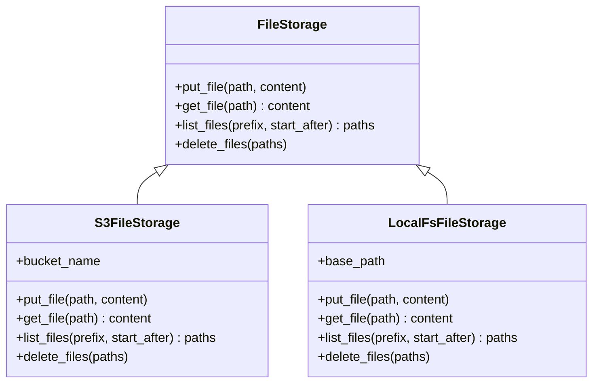

[comment]: <> (This file is auto-generated. Do not edit directly.)

# Scenario: ms1_woodstock_uses_a_pluggable_file_storage

## Woodstock uses a pluggable file storage

All file I/O in woodstock — writing trace log entries, uploading blobs, listing new entries,
fetching blob content, and deleting old traces — goes through a `FileStorage` abstraction.
Two implementations are provided: `S3FileStorage` (production) and `LocalFsFileStorage`
(local development and testing). The active implementation is selected via settings.

The `FileStorage` interface provides four operations:

- `put_file(path, content)` — write a file at the given path
- `get_file(path)` — read the content of a file at the given path
- `list_files(prefix, start_after)` — list files under a prefix, lexicographically ordered,
  starting after the given key (mirrors the S3 `list_objects` + `StartAfter` semantics;
  the local implementation uses a sorted `os.scandir` with the same cursor logic)
- `delete_files(paths)` — delete a set of files by path

`S3FileStorage` maps these to boto3 calls against a configured bucket.
`LocalFsFileStorage` maps them to plain filesystem operations under a configured base directory.

## Steps

### It selects a storage backend from settings

The operator configures either an S3 bucket name (for `S3FileStorage`) or a local base path
(for `LocalFsFileStorage`) in the woodstock settings. 
All actions receive the `FileStorage` instance — they never import boto3 or touch the filesystem directly. 

## Diagram

### Legend

| Participant | Module path |
|---|---|
| FileStorage | `c.Woodstock.Storage.Models.FileStorage` |
| S3FileStorage | `c.Woodstock.Storage.Models.S3FileStorage` |
| LocalFsFileStorage | `c.Woodstock.Storage.Models.LocalFsFileStorage` |

