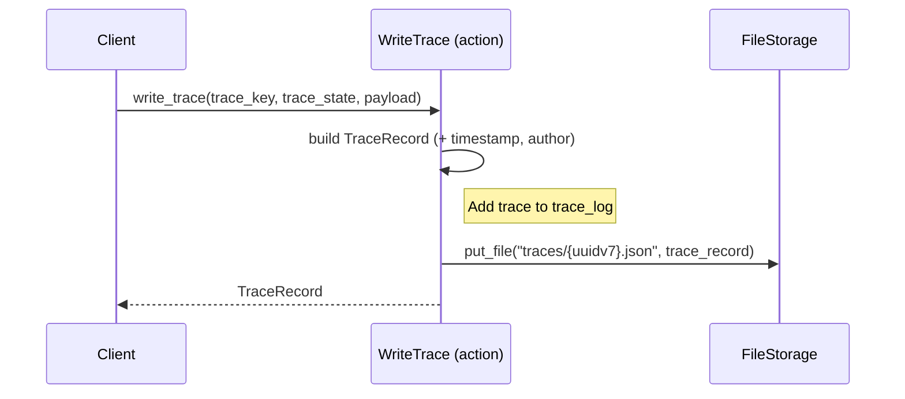

[comment]: <> (This file is auto-generated. Do not edit directly.)

# Scenario: ms2_a_client_writes_a_simple_trace

## A client writes a simple trace

A client (e.g. calcium, calcite) uses woodstock to write a trace record to the trace log.
The trace record contains a `trace_key` that identifies the event being traced, as well as its location
in the trace tree.

### Traces correspond to events

A `trace_key` identifies a specific event within the trace tree, for example: `job-123/calc-456/calculation_started`,
`job-123/calc-456/calculation_running`, and `job-123/calc-456/calculation_failed`. Each event trace has its own payload describing
what happened at that point.

### Parent trace nodes can hold shared information

The above trace nodes imply that a trace node of `job-123/calc-456` also exists. This parent node doesn't
correspond to an actual event, but it can hold shared information for its child event traces.

## Steps

### It builds the trace record

The `WriteTrace` action constructs a `TraceRecord` from the supplied `trace_key`, `trace_state`,
and `payload` dict, adding a UTC `timestamp` and the configured `author` name. 
The `payload` uses the woodstock DSL: values are prefixed with `value://`, `link://`, `ref://`,
or `tree://` to describe how the UI should render each field. 

### It writes the trace record to the trace log

The action generates a UUID v7 key (lexicographically time-ordered) and calls
`FileStorage.put_file` to write the `TraceRecord` as JSON at `traces/{uuidv7}.json`. 
Because UUID v7 keys are lexicographically time-ordered, the woodstock-server can later
use `list_files(start_after=last_seen_key)` to find only new entries — no coordination needed. 
This works identically for `S3FileStorage` and `LocalFsFileStorage`. 

## Diagram

### Legend

| Participant | Module path |
|---|---|
| WriteTrace | `c.Woodstock.Trace.Actions.WriteTrace` |
| FileStorage | `c.Woodstock.Storage.Models.FileStorage` |

