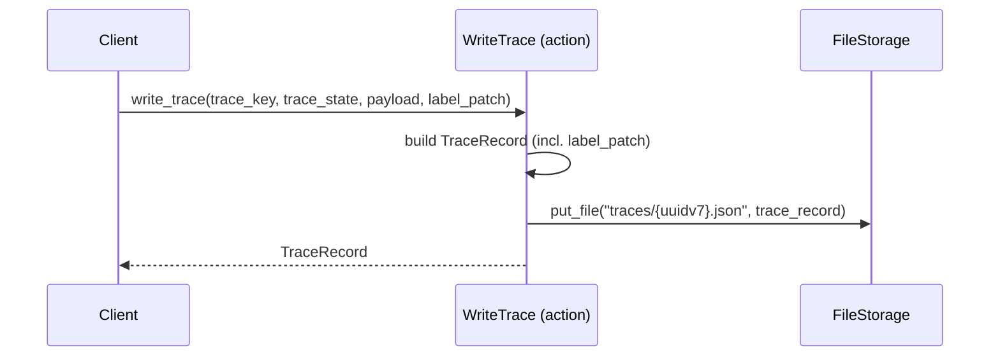

[comment]: <> (This file is auto-generated. Do not edit directly.)

# Scenario: ms4_a_client_labels_trace_nodes

## A client labels trace nodes

A trace record can carry a `labels` dict that applies label patches to one or more trace nodes.
Labels are separate from the payload: they are used for filtering and UI rendering hints,
not for describing the event itself.

## Label structure

The `labels` key in a trace record is a dict mapping a `node_key` to a dict of label name/value
pairs:

```json
{
  "trace_key": "job-123/calc-456/calculation_started",
  "trace_state": "ok",
  "payload": {"status": "value://started"},
  "labels": {
    "job-123": {"active": true},
    "job-123/calc-456": {"active": true}
  }
}
```

A label value of `null` drops the label from the node. Any other value sets it.
The `labels` dict is optional; traces without labels behave exactly as in ms2 and ms3.

A single trace record may label any number of nodes, including ancestors of `trace_key`.
This is the intended mechanism for propagating state upwards in the tree — for example,
marking a parent job as active when a child calculation starts.

## Label replay semantics

Labels are event-sourced. The label state of a node is determined by replaying all trace
records in UUID v7 order (i.e. write-time order) and applying each `labels` patch in turn.
The last writer wins for each `(node_key, label_name)` pair.

Writers are expected to own disjoint subtrees in practice (e.g. one writer per job), so
concurrent label conflicts are unlikely. Where they do occur the outcome is a cosmetic
inconsistency in the UI — label state does not affect the correctness of the trace log itself.

## Steps

### It includes the label patch in the trace record

`WriteTrace` passes the `label_patch` through into the `TraceRecord` unchanged and writes it
to `traces/{uuidv7}.json` alongside `trace_key`, `trace_state`, `payload`, and `author`.</br>
No validation of label names or values is performed by Woodstock — the label vocabulary is
intentionally open-ended.</br>

## Diagram



### Legend

| Participant | Module path |
|---|---|
| WriteTrace | `c.Woodstock.Trace.Actions.WriteTrace` |
| FileStorage | `c.Woodstock.Storage.Models.FileStorage` |

