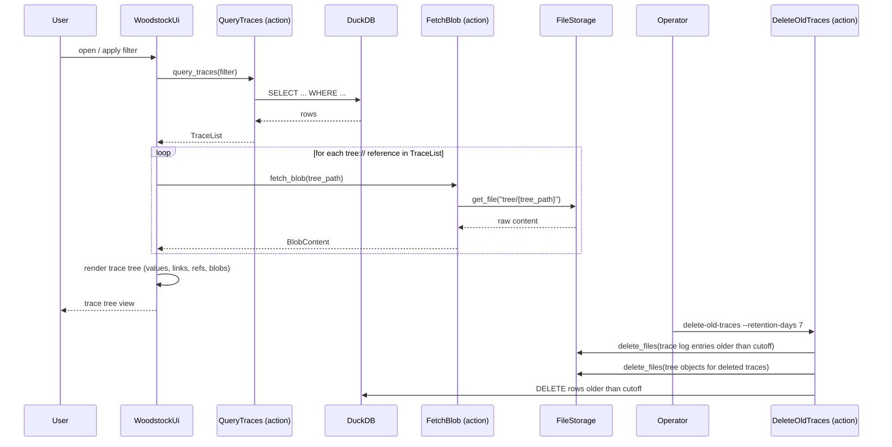

[comment]: <> (This file is auto-generated. Do not edit directly.)

# Scenario: ms6_the_woodstock_ui_queries_and_displays_traces

## The woodstock UI queries and displays traces

The woodstock UI lets a user browse and filter the trace tree. It queries the woodstock-server,
which answers from its DuckDB index. The indexer and the server share a DuckDB file on disk
(path configured via `WOODSTOCK_DUCKDB_PATH`), so traces written by the indexer are immediately
queryable by the server.

When rendering a trace, all `tree://` payload references are fetched immediately so the user
sees the full trace — including any Markdown documents or JSON blobs — without having to click
through.

An operator can also run the `delete-old-traces` CLI entrypoint to delete traces older than a
given number of days. The entrypoint calls `DeleteOldTraces` directly, which removes the
matching entries from the S3 trace log, the S3 tree, and the DuckDB index.

The woodstock-server is a Bottle-based HTTP server.

## Steps

### It sends a filter query to the server

The user opens the woodstock UI and optionally sets filters (trace key prefix, trace state,
author, time range). 
The UI sends the filter to the `QueryTraces` action on the woodstock-server. 

### It queries the DuckDB index

`QueryTraces` translates the filter into a DuckDB query and returns a `TraceList`. 
The response includes `trace_key`, `trace_state`, `author`, `timestamp`, and the full payload
for each matching trace. 
Because the index is a local DuckDB file shared with the indexer, this query is fast even over
large trace histories. 

### It renders the trace tree and fetches all blobs

The UI groups results by `trace_key` prefix to show the hierarchical tree. 
Each node's payload fields are rendered according to their DSL prefix:
`value://` as a key-value table, `link://` as clickable external links, and `ref://` as
navigable cross-references within the woodstock UI. 
For every `tree://` reference in the payload, the UI calls `FetchBlob` on the woodstock-server,
which calls `FileStorage.get_file(tree_path)` and returns the content as `BlobContent`. 
The blob is rendered immediately in the documents section — no additional user interaction
is required. 

### It deletes old traces via the CLI

An operator runs the `delete-old-traces` entrypoint with a `--retention-days` argument (integer
number of days). 
The entrypoint calls `DeleteOldTraces` with the given number of days. 
`DeleteOldTraces` calls `FileStorage.delete_files` for the matching trace log entries, then
again for the corresponding tree objects, and finally purges the matching rows from the
DuckDB index. 

## Diagram

### Legend

| Participant | Module path |
|---|---|
| QueryTraces | `c.Woodstock.Server.Actions.QueryTraces` |
| FetchBlob | `c.Woodstock.Server.Actions.FetchBlob` |
| DeleteOldTraces | `c.Woodstock.Server.Actions.DeleteOldTraces` |
| RetentionDays | integer number of days passed directly as a CLI argument |
| FileStorage | `c.Woodstock.Storage.Models.FileStorage` |

