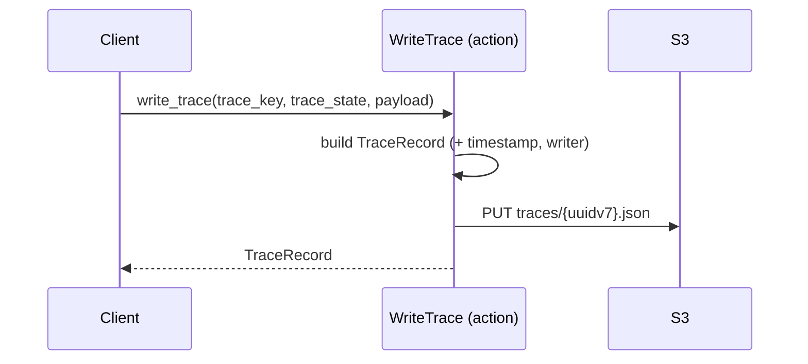

[comment]: <> (This file is auto-generated. Do not edit directly.)

# Scenario: ms1_a_client_writes_a_simple_trace

## A client writes a simple trace

A client (e.g. calcium, calcite) uses the woodstock_sdk to write a trace record.
For a simple trace — one with no large payload blobs — a single PUT to S3 is all that is needed.

### Steps

#### It builds the trace record

The `WriteTrace` action constructs a `TraceRecord` from the supplied `trace_key`, `trace_state`,
and `payload` dict, adding a UTC `timestamp` and the configured `writer` name. 
The `payload` uses the woodstock DSL: values are prefixed with `value://`, `link://`, `ref://`,
or `tree://` to describe how the UI should render each field. 

#### It writes the trace record to the trace log

The action generates a UUID v7 key (lexicographically time-ordered) and writes the
`TraceRecord` as a JSON file to `traces/{uuidv7}.json` on S3. 
Because S3 list operations are lexicographically ordered, the woodstock-server can later
use `StartAfter` on the last-seen key to find only new entries — no coordination needed. 

### Diagram

### Legend

| Participant | Module path |
|---|---|
| WriteTrace | `c.WoodstockSdk.Trace.Actions.WriteTrace` |

