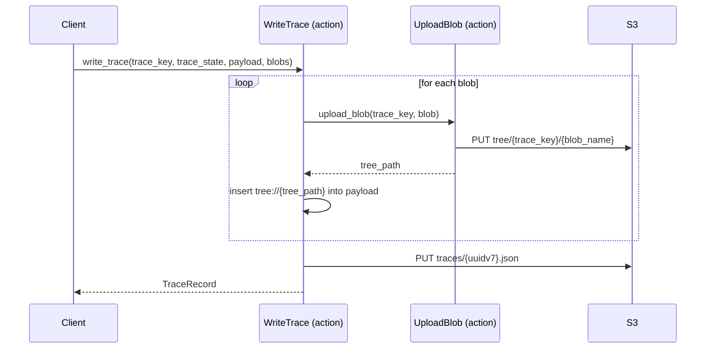

[comment]: <> (This file is auto-generated. Do not edit directly.)

# Scenario: ms2_a_client_writes_a_trace_with_a_payload_blob

## A client writes a trace with a payload blob

When a trace payload contains large or rich content (e.g. a Markdown error report), the client
passes blobs alongside the trace. The SDK uploads each blob to the S3 tree first, then inserts
a `tree://` reference into the payload alongside any other DSL-prefixed values already there
(e.g. `value://`, `link://`, `ref://`). The resulting trace record written to the trace log is
lightweight, while the rich content lives in the tree.

### Steps

#### It uploads each blob to the S3 tree

For every `Blob` supplied by the client, `UploadBlob` writes the blob's content to
`tree/{trace_key}/{blob_name}` on S3 and returns the tree path. 
A `tree://` reference for that path is then inserted into the payload dict as an additional
key alongside whatever `value://`, `link://`, or `ref://` keys the client already provided. 
For example, a payload might contain `"severity": "value://high"`,
`"calculation_page": "link://https://calcite/jobs/123/calculations/abc"`, and
`"full_error": "tree://job-123/calc-456/error.md"` all at once. 

#### It writes the trace record to the trace log

With all blob references inserted, `WriteTrace` writes the `TraceRecord` to
`traces/{uuidv7}.json` — identical to the simple trace case. 
The woodstock-server never needs to crawl the tree to build its index;
it only fetches tree paths when rendering a trace for the user. 

### Diagram

### Legend

| Participant | Module path |
|---|---|
| WriteTrace | `c.WoodstockSdk.Trace.Actions.WriteTrace` |
| UploadBlob | `c.WoodstockSdk.Trace.Actions.UploadBlob` |

