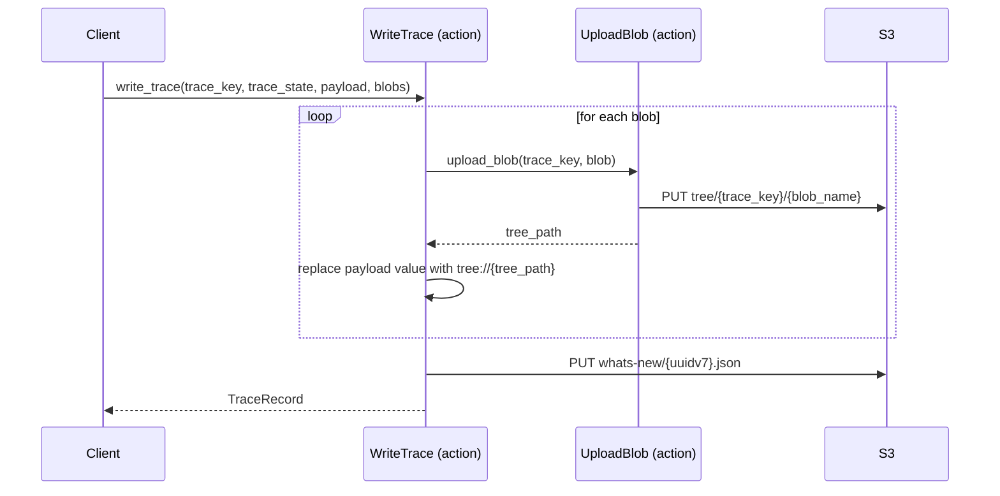

[comment]: <> (This file is auto-generated. Do not edit directly.)

# Scenario: ms2_a_client_writes_a_trace_with_a_payload_blob

## A client writes a trace with a payload blob

When a trace payload contains large or rich content (e.g. a Markdown error report), the client
passes blobs alongside the trace. The SDK uploads each blob to the S3 tree first, then writes a
lightweight trace record that references the blob via a `tree://` DSL value.

### Steps

#### It uploads each blob to the S3 tree

For every `Blob` supplied by the client, `UploadBlob` writes the blob's content to
`tree/{trace_key}/{blob_name}` on S3. 
The corresponding payload field in the trace record is updated to a `tree://` reference,
e.g. `"error.md": "tree://job-123/calc-456/error.md"`. 
This keeps the whats-new entry small while the rich content lives in the tree. 

#### It writes the trace record to the whats-new log

With all blob references resolved, `WriteTrace` writes the `TraceRecord` to
`whats-new/{uuidv7}.json` — identical to the simple trace case. 
The woodstock-server never needs to crawl the tree to build its index;
it only fetches tree paths when a user requests to view a specific payload. 

### Diagram

