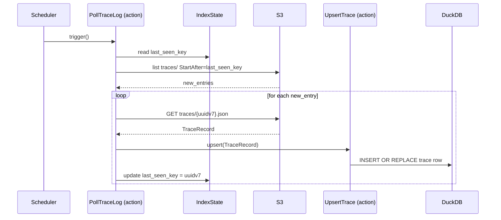

[comment]: <> (This file is auto-generated. Do not edit directly.)

# Scenario: ms3_the_woodstock_server_indexes_new_traces

## The woodstock-server indexes new traces

The woodstock-server maintains a DuckDB index that it builds incrementally from the append-only
trace log on S3. A scheduler triggers a poll at a regular interval; the server fetches only
the entries it has not yet seen and upserts them into the index.

### Steps

#### It finds new trace log entries

`PollTraceLog` reads the `last_seen_key` from `IndexState` — the UUID v7 key of the last
trace log entry it processed. 
It calls `S3.list_objects` with `StartAfter={last_seen_key}` to retrieve only newer entries. 
Because UUID v7 keys are lexicographically ordered by time, this is always correct — no
coordination or locking is needed. 

#### It upserts each new trace into the DuckDB index

For each new entry, the server reads the `TraceRecord` JSON and calls `UpsertTrace` to insert
or update the row in DuckDB (keyed on `trace_key` + `uuidv7`). 
After processing each entry, it advances the `last_seen_key` in `IndexState`. 
The DuckDB index is now queryable for filtering by `trace_key`, `trace_state`, `writer`,
and `timestamp` — without touching the S3 tree. 

### Diagram

### Legend

| Participant | Module path |
|---|---|
| PollTraceLog | `c.WoodstockServer.Index.Actions.PollTraceLog` |
| UpsertTrace | `c.WoodstockServer.Index.Actions.UpsertTrace` |
| IndexState | `c.WoodstockServer.Index.Models.IndexState` |

