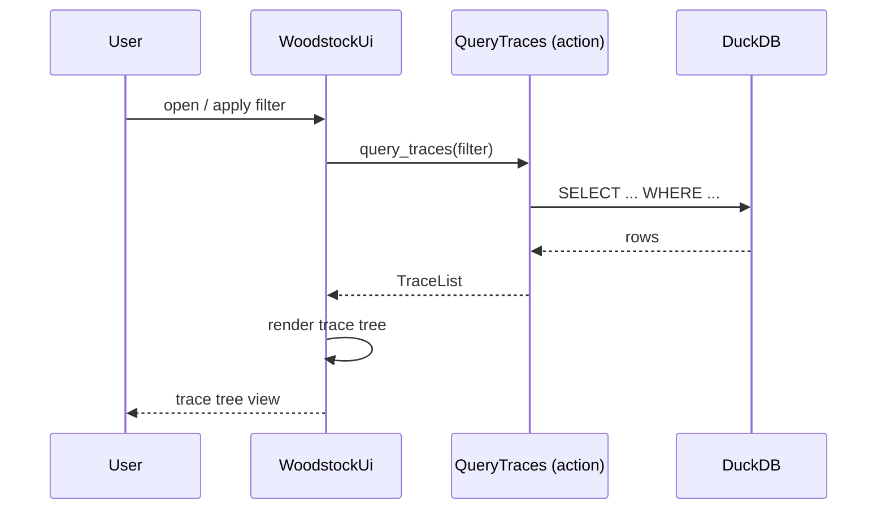

[comment]: <> (This file is auto-generated. Do not edit directly.)

# Scenario: ms4_the_woodstock_ui_queries_and_displays_traces

## The woodstock UI queries and displays traces

The woodstock UI lets a user browse and filter the trace tree. It queries the woodstock-server,
which answers purely from its DuckDB index — no S3 access is needed at this stage.

### Steps

#### It sends a filter query to the server

The user opens the woodstock UI and optionally sets filters (trace key prefix, trace state,
writer, time range). 
The UI sends the filter to the `QueryTraces` action on the woodstock-server. 

#### It queries the DuckDB index

`QueryTraces` translates the filter into a DuckDB query and returns a `TraceList`. 
The response includes `trace_key`, `trace_state`, `writer`, `timestamp`, and the inline
payload for each matching trace — everything needed to render the tree view. 
Because the index is local to the server, this query is fast even over large trace histories. 

#### It renders the trace tree

The UI groups results by `trace_key` prefix to show the hierarchical tree. 
Each node displays its `trace_state` as a badge and its payload fields grouped by DSL prefix
(`value://` as a key-value table, `link://` as clickable links, `ref://` as navigable
cross-references within the UI, `tree://` as on-demand document links). 

### Diagram

