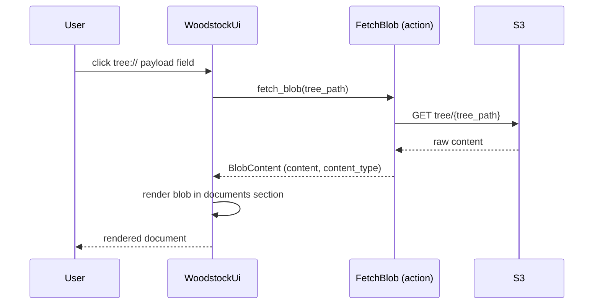

[comment]: <> (This file is auto-generated. Do not edit directly.)

# Scenario: ms5_the_woodstock_ui_fetches_and_renders_a_payload_blob

## The woodstock UI fetches and renders a payload blob

When a user clicks on a `tree://` reference in a trace payload, the woodstock UI fetches the
blob from S3 via the woodstock-server and renders it in the documents section of the trace view.

### Steps

#### It requests the blob from the server

The user clicks a `tree://` payload field (e.g. `"full_error": "tree://job-123/calc-456/error.md"`). 
The UI strips the `tree://` prefix and calls `FetchBlob` on the woodstock-server with the
resolved S3 tree path. 

#### It fetches the blob from S3

`FetchBlob` retrieves the raw content from `tree/{tree_path}` on S3 and returns it as
`BlobContent`, including the content type so the UI knows how to render it. 
Common types are Markdown (rendered as formatted text) and JSON (rendered as a code block). 

#### It renders the blob in the documents section

The UI displays the blob content in the documents section of the trace view, below the
key-value and links sections. 

### Diagram

