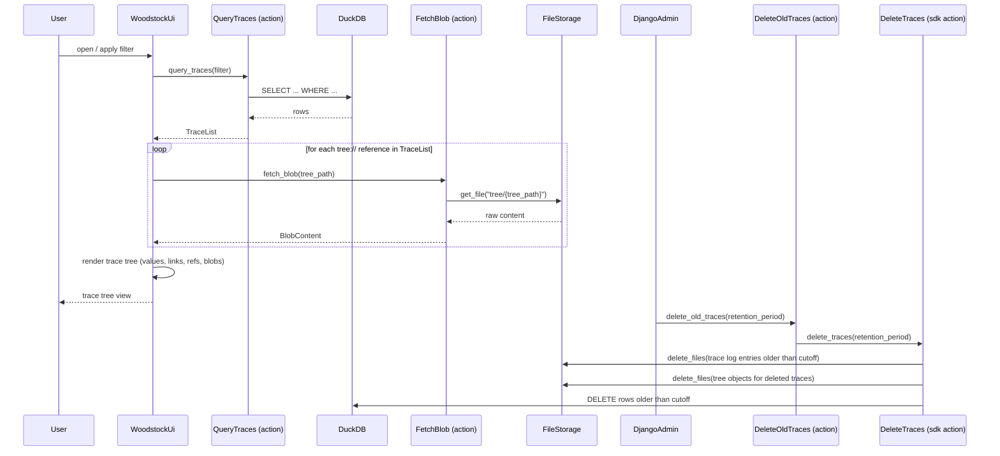

[comment]: <> (This file is auto-generated. Do not edit directly.)

# Scenario: ms5_the_woodstock_ui_queries_and_displays_traces

## The woodstock UI queries and displays traces

The woodstock UI lets a user browse and filter the trace tree. It queries the woodstock-server,
which answers from its DuckDB index. When rendering a trace, all `tree://` payload references
are fetched immediately so the user sees the full trace — including any Markdown documents or
JSON blobs — without having to click through.

An administrator can also use the django-admin to delete traces older than a chosen retention
period (one week, two weeks, or one month). The woodstock-server delegates the actual deletion
to `DeleteTraces` in the woodstock_sdk, which removes the matching entries from the S3 trace
log, the S3 tree, and the DuckDB index.

## Steps

### It sends a filter query to the server

The user opens the woodstock UI and optionally sets filters (trace key prefix, trace state,
writer, time range). 
The UI sends the filter to the `QueryTraces` action on the woodstock-server. 

### It queries the DuckDB index

`QueryTraces` translates the filter into a DuckDB query and returns a `TraceList`. 
The response includes `trace_key`, `trace_state`, `writer`, `timestamp`, and the full payload
for each matching trace. 
Because the index is local to the server, this query is fast even over large trace histories. 

### It renders the trace tree and fetches all blobs

The UI groups results by `trace_key` prefix to show the hierarchical tree. 
Each node's payload fields are rendered according to their DSL prefix:
`value://` as a key-value table, `link://` as clickable external links, and `ref://` as
navigable cross-references within the woodstock UI. 
For every `tree://` reference in the payload, the UI calls `FetchBlob` on the woodstock-server,
which calls `FileStorage.get_file(tree_path)` and returns the content as `BlobContent`. 
The blob is rendered immediately in the documents section — no additional user interaction
is required. 

### It deletes old traces via the django-admin

An administrator opens the django-admin and selects a `RetentionPeriod` (one week, two weeks,
or one month), then triggers the `DeleteOldTraces` action on the woodstock-server. 
`DeleteOldTraces` calls `DeleteTraces` in the woodstock_sdk, passing the chosen retention period. 
`DeleteTraces` calls `FileStorage.delete_files` for the matching trace log entries, then again
for the corresponding tree objects, and finally purges the matching rows from the DuckDB index. 

## Diagram

### Legend

| Participant | Module path |
|---|---|
| QueryTraces | `c.WoodstockServer.Query.Actions.QueryTraces` |
| FetchBlob | `c.WoodstockServer.Query.Actions.FetchBlob` |
| DeleteOldTraces | `c.WoodstockServer.Manage.Actions.DeleteOldTraces` |
| DeleteTraces | `c.WoodstockSdk.Traces.Actions.DeleteTraces` |
| RetentionPeriod | `c.WoodstockServer.Manage.Models.RetentionPeriod` |
| FileStorage | `c.WoodstockSdk.Storage.Models.FileStorage` |

